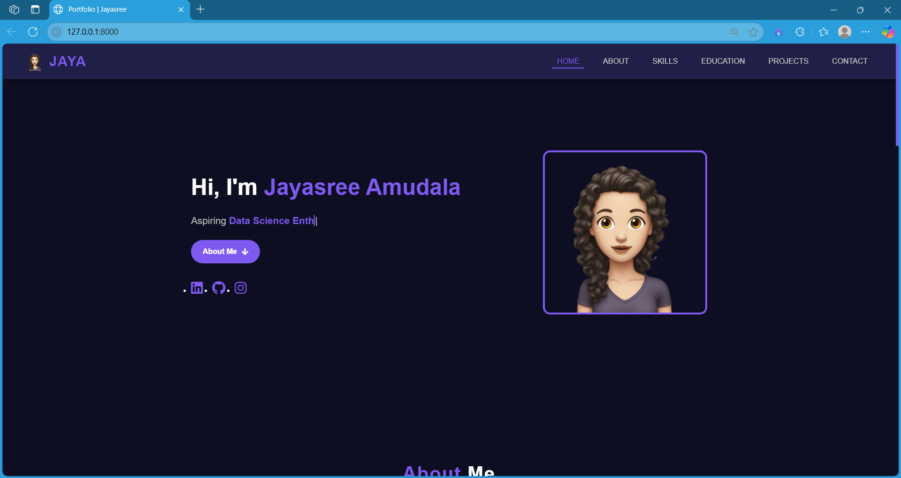
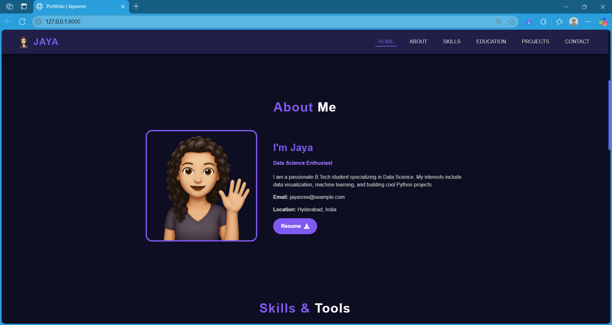
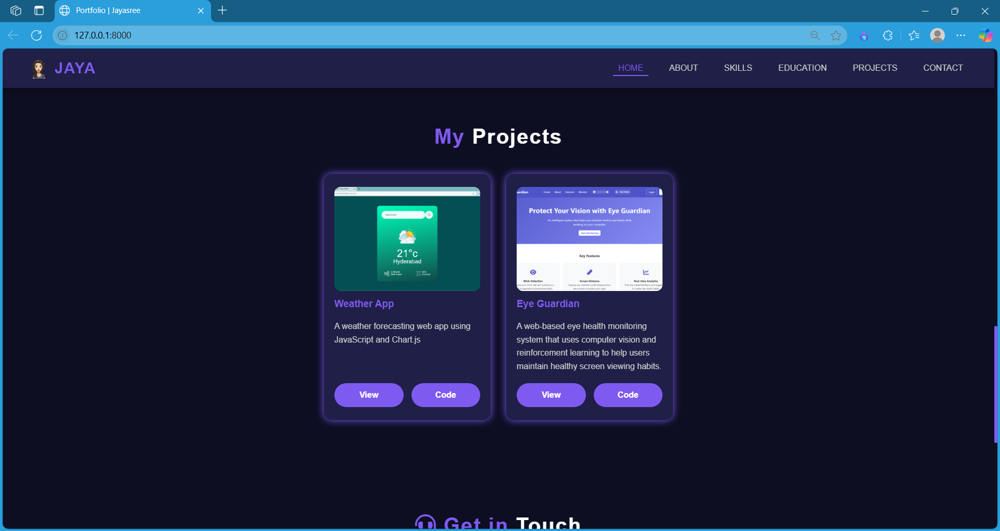

# My Portfolio Website (Django)

This is my personal portfolio website built using Django. It demonstrates my web development skills and showcases my projects, skills, and contact information.

## Features

- Built with Django framework (Python)
- Responsive and modern UI with CSS and JavaScript
- User-friendly navigation and smooth scrolling
- Includes static files (CSS, JS) and templates
- Uses SQLite (default Django DB) 

## Technologies Used

- Python 3.x
- Django 4.x
- HTML5, CSS3, JavaScript
- SQLite (default DB, can be changed)

## Setup & Installation

1. **Clone the repository:**

   ```bash
   git clone https://github.com/jayasree-007/portfolio.git
   cd portfolio
2. **Install required packages:**

   ```bash
   pip install -r requirements.txt
3. **Run migrations:**

    ```bash
    python manage.py migrate
4. **Run the development server:**

    ```bash
    python manage.py runserver
5. **Open your browser and go to:**

    ```bash
    http://127.0.0.1:8000/

## Output Samples

Here are some screenshots of the project in action:








